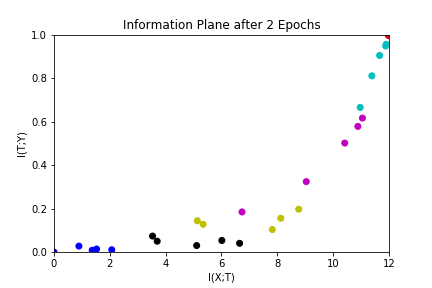
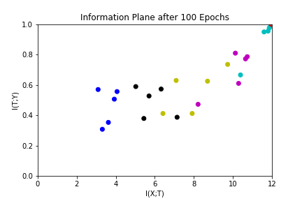
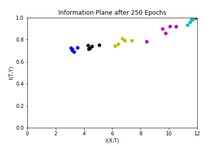
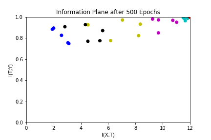
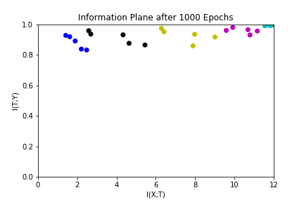
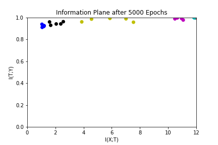
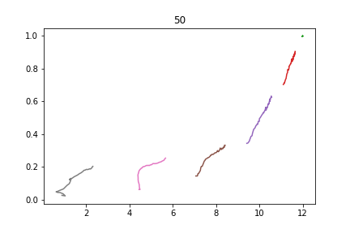

# Deep Learning & Mutual Information
Recreation of figures from 'Opening the Black Box of Deep Neural Networks via Information' (https://arxiv.org/abs/1703.00810)

The main goal of this project was to recreate Figure 2 from the paper. I used the paper's dataset and my simplified version of the source code (https://github.com/ravidziv/IDNNs) to create these plots.

Each plot represents the information plane after a set number of epochs and shows the relationship between the mutual information between the input and a hidden layer I(X;T) and the mutual information between the hidden layer and the output I(T;Y).

We wanted to see how much information is preserved through the layers. When training begins, we see that the hidden layers do not contain much information about the output. However, as training continues, we see that I(T;Y) increases both when the we go deeper into the hidden layers and when we have more epochs. This increases is expected from how we train our neural network by cross-entropy loss minimization.

In addition, we see after optimization with I(T;Y), that I(X;T) decreases significantly. This can be seen when we compare the information after 1000 epochs and 5000 epochs. This decrease represents compression, which is important for generalizing neural networks to different inputs.

## Network and Plots
### Specifications
- 7 fully connected hidden layers (12-10-7-5-4-3-2)
- Activation functions: hyperbolic tangent function
- Activation function for final layer: sigmoidal function
- Used discretized outputs of layers (Divided outputs into 30 equal intervals)

### Plots
Series of information plane plots after a given number of epochs.  Colors represent the different hidden layers. Plot shows 5 randomized networks.

The next plot shows the evolution of the information plane. This plots the mutual information after each epoch incrementally up to 50 epochs.

## Code
- `initalize.py`: This file builds, trains, and runs the network. All plots in this file can be created from running this file.
  - To start, I loaded all the data stored in `var_u.mat` and split the data into training and testing groups.
  - To create a neural network to train the data, I built a custom 8 layer neural network (7 fully connected hidden layers). Specifications are noted above.
  - I trained the neural network by using the Adam Optimizer to minimize cross entropy.
  - As I trained, I also collected the outputs from each hidden layer that would be later used to calculate information about the neural network.
  - After training, and calculating information, I created plots using matplotlib and color coded the hidden layers. To create more plots of varying epoch snapshots, change `epochs_list = [2, 100, 250, 500, 1000, 5000]`.
  - Code framework based on tutorial code (Reference 3)
- `calc_info.py` Extracts information from neural network.
  - Takes data from the output hidden layers and create discretized distributions.
  - Use samples from the discretized distributions to calculate mutual information between layers.
  - Code based from source code (Reference 2). Modified to make it more simple and appropriate for this project.
- `mutual_information_calc.py` Calculates mutual information.
  - Calculates conditional probabilities, entropy, conditional entropy, and mutual information
  - I(X;T) = H(X) - H(X|T)
  - I(T;Y) = H(T) - H(T|Y)
  - Code from source code (Reference 2).
- `var_u.mat` Dataset for neural network
- `plots` Folder containing plots

## References
1. https://arxiv.org/abs/1703.00810 Research Paper
2. https://github.com/ravidziv/IDNNs Source Code
3. https://pythonprogramming.net/tensorflow-neural-network-session-machine-learning-tutorial/?completed=/tensorflow-deep-neural-network-machine-learning-tutorial/ Deep Neural Network Tutorial Code
